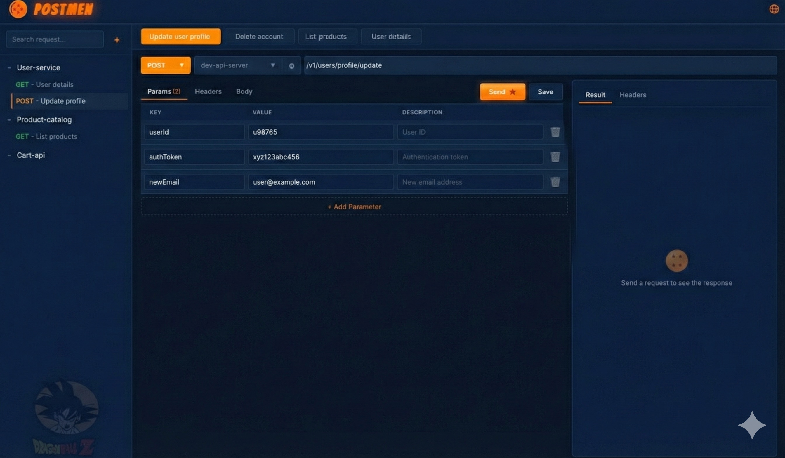
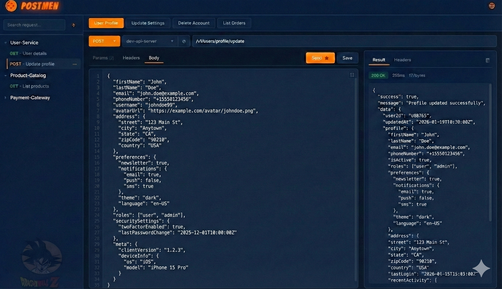

<h1 align="center">PostMen</h1>

<p align="center">
  <strong>A Dragon Ball themed REST API Client built with Rust</strong>
</p>

<p align="center">
  
  
  
  
</p>

<p align="center">
  
</p>

---

## Screenshots

<p align="center">
  
</p>

<p align="center">
  <em>Request editor with params, headers, and organized project sidebar</em>
</p>

<p align="center">
  
</p>

<p align="center">
  <em>JSON body editor with syntax highlighting and formatted response view</em>
</p>

---

## About

**PostMen** is a lightweight, fast, and visually striking REST API client featuring a unique Dragon Ball inspired design. Built entirely in Rust using the Dioxus framework, it provides a native desktop experience with modern UI/UX patterns.

### Key Features

- **Project Organization** — Organize your API requests into projects and folders
- **Multiple Tabs** — Work with multiple requests simultaneously
- **HTTP Methods** — Support for GET, POST, PUT, DELETE, and OPTIONS
- **Request Parameters** — Easily manage query parameters with descriptions
- **Custom Headers** — Add and manage HTTP headers per request
- **JSON Body Editor** — Syntax-highlighted JSON editor with formatting
- **Multipart Form Data** — Support for file uploads and form data
- **Response Viewer** — View response body, headers, status, and timing
- **Hostname Management** — Configure and switch between different API environments
- **Local Storage** — All data stored locally in SQLite database
- **Native Performance** — Built with Rust for blazing fast performance

---

## Tech Stack

| Component | Technology |
|-----------|------------|
| Language | Rust |
| UI Framework | [Dioxus 0.7](https://dioxuslabs.com/) |
| HTTP Client | reqwest |
| Database | SQLite (rusqlite) |
| Async Runtime | Tokio |
| Native Menus | muda |

---

## Installation

### Prerequisites

- [Rust](https://rustup.rs/) (1.70 or later)
- Cargo (comes with Rust)

### Build from Source

```bash
# Clone the repository
git clone https://github.com/yourusername/postmen.git
cd postmen

# Build and run in development mode
cargo run

# Build for release
cargo build --release
```

The release binary will be available at `target/release/postmen`.

---

## Usage

1. **Create a Project** — Click the `+` button in the sidebar to create a new project
2. **Add Requests** — Right-click on a project to add new requests
3. **Configure Hostnames** — Click the globe icon in the header to manage API base URLs
4. **Send Requests** — Fill in the request details and click "Send"
5. **View Responses** — Check the response panel for results, headers, and timing

---

## Roadmap

Planned features for future releases:

- [ ] **Authentication Support** — OAuth 2.0, Basic Auth, Bearer Token, API Keys
- [ ] **Environment Variables** — Support for `{{variable}}` syntax in requests
- [ ] **Postman Import** — Import collections from Postman JSON format
- [ ] **Request History** — Browse and restore previous requests
- [ ] **Code Generation** — Generate code snippets in various languages
- [ ] **WebSocket Support** — Test WebSocket connections

---

## Disclaimer

> **This application is 100% vibe coded** — built with passion during creative coding sessions, powered by curiosity and good vibes.

> **Hobby Project Notice**: PostMen is a personal hobby project created for learning and experimentation purposes. It is **not intended for wide distribution or commercial use**. Use at your own discretion.

---

## Contributing

As this is a personal hobby project, contributions are not actively sought. However, feel free to fork the repository and adapt it for your own use.

---

## License

This project is licensed under the MIT License - see the [LICENSE](LICENSE) file for details.

---

<p align="center">
  <sub>Built with 🔥 and Rust</sub>
</p>
