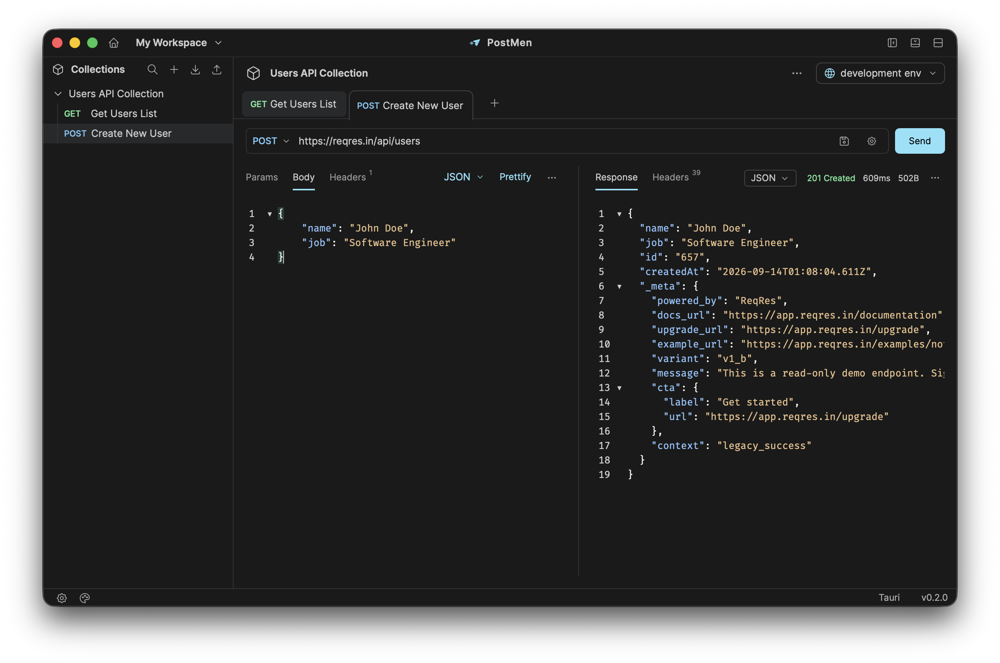

<p align="center">
  
</p>

<h1 align="center">PostMen</h1>

<p align="center">A local-first desktop REST API client built with Tauri 2, Vue 3, TypeScript, Rust and SQLite.</p>



## Features

- **Workspaces:** independent collections, environments, saved tabs and history; create, switch, set a default and manage workspaces without hiding the sidebar.
- **Collections & requests:** nested folders, search, persistent expand/collapse, reorder, rename, clone and delete. Create HTTP requests manually or import from cURL.
- **Request editor:** synchronized URL/query parameters, header autocomplete, JSON/raw text and multipart bodies, file attachments, independent drafts and undo history.
- **Environments:** select Collection and Global environments together; use `<<variable>>` in URLs, parameters and headers with autocomplete and value tooltips.
- **Send & inspect:** native Rust HTTP, cancellation, verified TLS, response status/timing/headers, formatted or raw read-only previews and execution metadata history.
- **Desktop experience:** light/dark/system themes, cyan accent `#8BE2FA`, resizable split panes, keyboard shortcuts, saved window geometry, notifications and unsaved-change Quit confirmation.
- **Postman compatibility:** import Collection v2.0/v2.1 JSON through file picker or drag-and-drop; export selected collections to v2.1 JSON with overwrite confirmation.

## Development

For macOS development, use **macOS 14+**, Xcode Command Line Tools, Rust/Cargo and npm. The working Rust toolchain is 1.92.0. Node must match `package.json`: `>=22.22.2 <23 || >=24.15.0`. Windows/Linux builds are not yet verified.

```sh
npm ci
npm run tauri:dev
```

Tauri starts Vite at `127.0.0.1:1420`; do not start a second Vite instance on that port. `npm run dev` alone provides a browser preview, not native storage or HTTP. Fully restart native dev after Rust, command, icon or configuration changes.

### Build & checks

```sh
npm run build                         # Typecheck and build the frontend
npm run lint
cargo clippy --manifest-path src-tauri/Cargo.toml --locked -- -D warnings
npm run tauri:build -- --bundles app   # macOS application bundle
```

Output: `src-tauri/target/release/bundle/macos/Postmen.app`. Local builds are not signed/notarized for distribution. Rebuild and replace an installed app to update it. Use a separate Cargo target directory when preserving an older build.

Tests are available via `npm test`, `npm run test:rust` and `npm run test:e2e` (requires Playwright browsers). Recent changes passed build/static checks; these commands are not a claim that all runtime tests were rerun. Broader visual and cross-monitor validation remains open.

## Usage

### Workspaces

Choose **Create workspace** from the title-bar dropdown. Edit the preselected name, then confirm with **✓ / Enter** or cancel with **× / Escape**. **Manage workspaces** offers icon-only Open, Set Default and Delete actions, plus Create Workspace at the top right.

The default workspace opens at startup and cannot be deleted. Changing the default does not switch the current session. Save/discard drafts and finish pending operations before switching. Saved tabs are restored per workspace.

**Workspace deletion is recoverable, not permanent erasure:** after confirmation, the entry disappears from the app but its database files remain on disk. Deleting the active workspace opens the default. There is no in-app Restore button; recovery requires a catalog repair with the app closed. Back up the catalog first. Workspace rename and moving collections between workspaces are not supported yet.

### Variables

```text
URL:      <<api_url>>/users
Header:   Authorization: Bearer <<token>>
```

Collection variables belong only to that collection. Global variables are shared by collections **within the same workspace**. Both environments can be selected independently; Collection values override Global values with the same name. Hover over a placeholder to inspect its resolved value. Body/multipart variable substitution is not supported.

### Import & export

Use the sidebar **down-arrow** to import and **up-arrow** to export.

- **Import:** preview the collection and validation warnings before saving. Name conflicts offer explicit overwrite or a new collection with an incrementing `_1` suffix. Postman `{{variables}}` become `<<variables>>`. Raw text/NDJSON is retained; complete `/* … */` comments outside strings are stripped. Blank query rows are skipped; meaningful invalid rows report their request/folder location.
- **Export:** select collections, optionally include selected environment variables, set file names and choose a destination. Each collection produces one JSON file. Existing files require **Yes, overwrite**; successful files remain if part of a batch fails.

Scripts, authentication helpers, response examples and attachment contents are not transferred. Re-select multipart files after import/export and review `Content-Type` for non-JSON bodies. Collection overwrite and confirmed file replacement have no automatic undo. Exported variables may contain credentials.

### Shortcuts

| Action | Shortcut |
| --- | --- |
| Send request | `Cmd/Ctrl + Enter` |
| Save request | `Cmd/Ctrl + S` |
| Close request tab | `Cmd/Ctrl + W` |
| Next / previous tab | `Ctrl + Tab` / `Ctrl + Shift + Tab` |
| Toggle sidebar | `Cmd/Ctrl + B` |
| Toggle response layout | `Cmd/Ctrl + Shift + L` |

## Storage & safety

Development and production have separate SQLite data, window state and WebView preferences. Their macOS application-data roots are:

```text
Production:  ~/Library/Application Support/com.postmen.desktop/
Development: ~/Library/Application Support/com.postmen.desktop.dev/
```

Within each profile:

```text
postmen.sqlite3                    Initial My Workspace data
workspaces/<UUID>/postmen.sqlite3  Additional workspace data
workspaces.v1.json                 Catalog, default and removed entries
```

Existing data stays in My Workspace; creating workspaces does not move or copy it. Legacy application databases/users are not migrated. A fresh window starts maximized, not fullscreen; later launches restore the saved size and position.

Data is stored locally in **plaintext**, not an encrypted secret vault. Unsaved drafts, undo history and response bodies are memory-only and can be lost on a crash or force-quit. Use the normal Quit flow to save/discard changes. Back up the entire profile with the app closed, including its catalog and SQLite sidecar files.

Limits: 100 active workspaces; 2 MiB saved bodies; 1 MiB decompressed response previews; 100 MiB total file uploads. HTTP defaults to a 30-second timeout, with TLS verification enabled. Cross-origin redirects stop at 3xx; automatic proxy configuration, custom CAs and disabling TLS verification are unavailable. HTTP is supported; GraphQL, gRPC and WebSocket modes are not.

## Repository

```text
frontend/src/     Vue UI, Pinia stores, typed IPC and editor services
src-tauri/        Rust backend, SQLite, native integration and app icons
tests/e2e/        Browser regression tests
scripts/          Build verification and opt-in QA tooling
assets/readme/    Application screenshot
licenses/         Dependency license texts
```

Detailed plans and historical QA reports live in a private Obsidian archive, exposed locally through the ignored `docs` symlink. They are not required to build the app. Development fixtures are excluded from production and must not receive real credentials.

## License

MIT — see [LICENSE](LICENSE). Asset and dependency attribution is in [THIRD_PARTY_NOTICES.md](THIRD_PARTY_NOTICES.md). PostMen is an independent project and is not affiliated with Postman.
